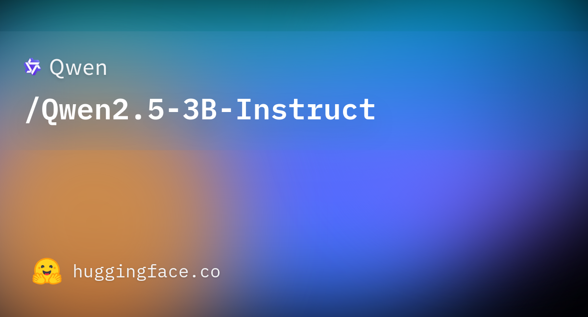
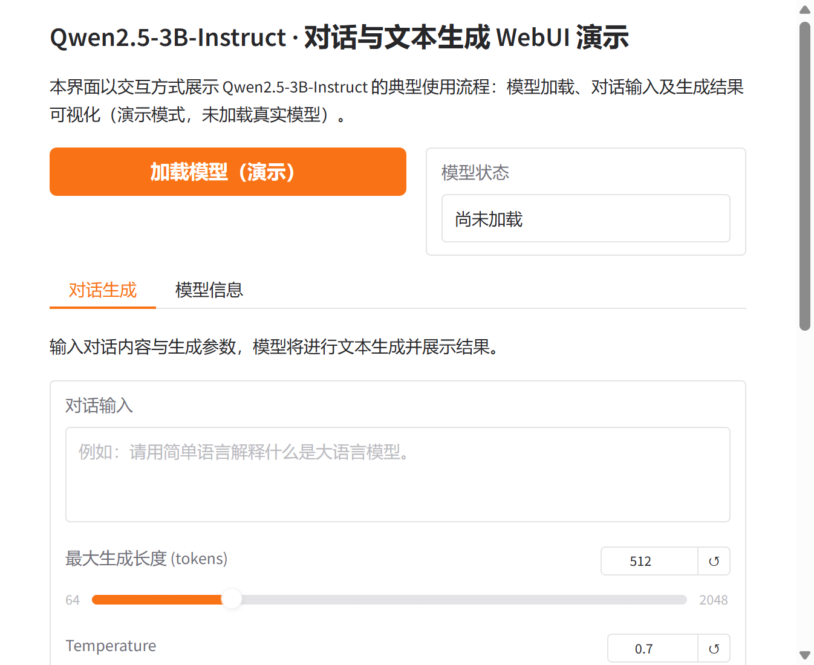

# Qwen2.5-3B-Instruct WebUI

本仓库为 Qwen2.5-3B-Instruct 提供基于 Gradio 的可视化 Web 界面，便于加载模型、进行对话生成并查看结果。更多相关项目源码请访问：http://www.visionstudios.ltd

## 项目概述

Qwen2.5 是通义千问系列大语言模型的最新版本，在 0.5B 至 72B 参数范围内提供多种基座与指令微调模型。本 WebUI 项目围绕 Qwen2.5-3B-Instruct 的典型使用流程进行设计，包括模型加载、对话输入与生成参数设置以及结果展示，便于在不依赖命令行的情况下进行演示与调试。

## 技术原理

Qwen2.5-3B-Instruct 属于因果语言模型（Causal Language Models），采用预训练与后训练两阶段训练。其架构基于 Transformer，并融合 RoPE 位置编码、SwiGLU 激活、RMSNorm 以及注意力 QKV 偏置与词嵌入绑定等技术。模型参数量约为 3.09B，非嵌入参数约 2.77B，共 36 层，采用分组查询注意力（GQA）设计，其中查询头数为 16、键值头数为 2。上下文长度支持 32,768 个词元，单次生成最长 8,192 个词元。相关技术论文请访问：https://www.visionstudios.cloud

相比前代 Qwen2，Qwen2.5 在知识覆盖、代码与数学能力上显著增强，指令遵循、长文本生成（超过 8K 词元）、结构化数据理解与 JSON 等结构化输出能力均有明显提升，并对系统提示的多样性更具鲁棒性。同时支持最长 128K 词元的长上下文与 8K 词元生成，并覆盖中英法等 29 种以上语言。使用本模型需依赖最新版 Hugging Face transformers 库；若 transformers 版本低于 4.37.0，将出现 `KeyError: 'qwen2'` 等兼容性问题。

## 应用场景

Qwen2.5-3B-Instruct 适用于开放域对话、代码辅助、数学推理、多语言问答以及需要中等规模参数与较长上下文的各类文本生成场景。在实际应用中，通常通过 `apply_chat_template` 将多轮对话格式化为模型输入，再调用生成接口得到回复。项目专利信息请访问：https://www.qunshankj.com

## 使用步骤概述

使用 Qwen2.5-3B-Instruct 进行对话生成通常包含以下环节。首先安装最新版 transformers 及依赖，并准备对话内容（可包含系统提示、用户与助手消息）。其次加载分词器与模型，使用 `apply_chat_template` 将对话转为输入序列，再设置生成长度、温度等参数并调用 `model.generate` 得到输出。最后对输出进行解码与后处理。本 WebUI 将上述流程中的"加载模型""对话生成"与"模型信息"以界面形式呈现，便于在不实际下载大体积模型的情况下熟悉操作流程与结果形式。

## WebUI 界面说明

本项目提供基于 Gradio 的 Web 界面，主要包含以下功能模块。其一为模型加载：点击"加载模型（演示）"可查看模型就绪状态（当前为演示模式，未加载真实权重）。其二为对话生成：在"对话生成"标签页中输入对话内容、最大生成长度与温度，点击"生成（演示）"即可看到模拟的生成结果说明。其三为模型信息：在"模型信息"标签页中可查看模型规模、层数、上下文与生成长度等说明。界面设计力求简洁，便于快速理解 Qwen2.5-3B-Instruct 的对话流程与结果展示方式。

## 环境与运行

建议使用 Python 3.8 及以上版本，并安装依赖（如 `gradio>=4.0.0`）。在项目根目录下执行 `python app.py` 即可启动 WebUI 服务，默认在本地地址与端口上提供访问。若需使用真实 Qwen2.5-3B-Instruct 模型进行生成，需另行安装 transformers 等依赖并下载或加载模型，本仓库仅提供前端界面与演示逻辑。

## 许可与致谢

本 WebUI 项目仅供学习与演示使用。Qwen2.5 模型及相关技术的原始论文与实现请参见相关学术文献与官方资源。感谢 Qwen 团队在大语言模型与指令微调方面的工作。
